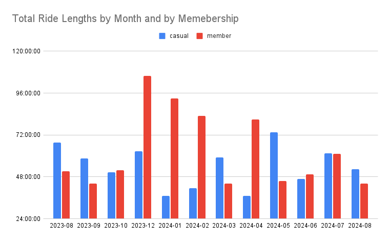
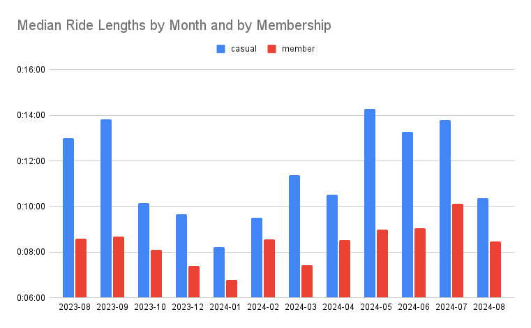
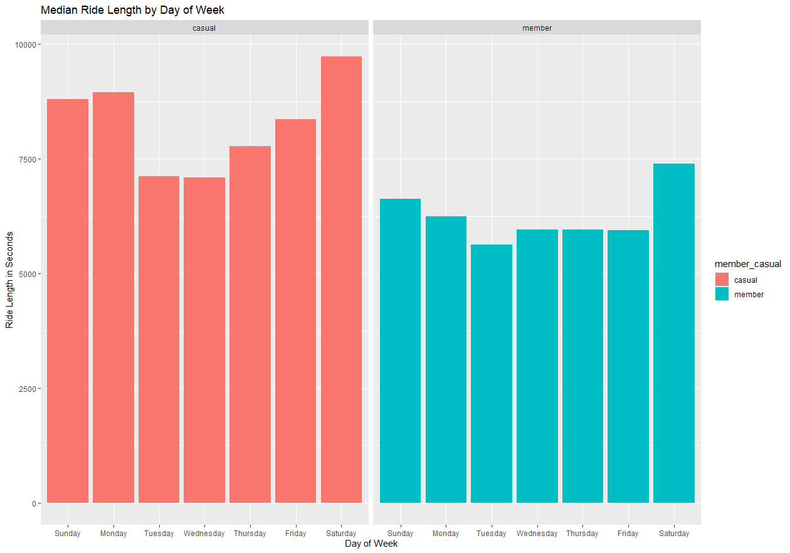
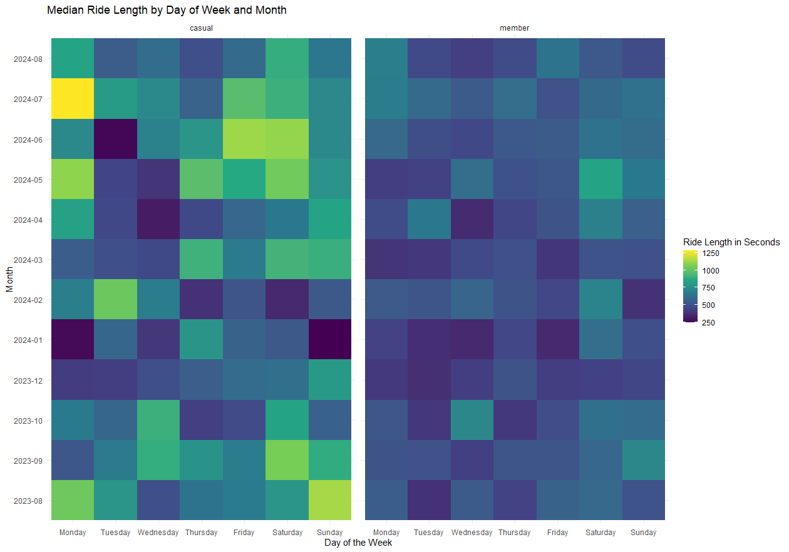

This repo shows my data analysis practice based on the case study of Cyclistic, a fictional bike rental company, from Google Data Analysis Certificate course.

# Business Task Statement

Cyclistic marketing teams is aiming at attracting its current casual riders to join the membership. To ahiceve the goal, this analysis compares the riding preferences between casual riders and members in terms of ride lengths, dates, and frequent days of week. The result is expected to assist the marketing team to further identify the characteristics of casual riders.

# Data Sources

This research uses the public data of bike rides from 2023-AUG to 2024-AUG from [Index of bucket "divvy-tripdata"](https://divvy-tripdata.s3.amazonaws.com/index.html) under [Data License Agreement | Divvy Bikes](https://divvybikes.com/data-license-agreement) to mock the data for Cyclistic. Given the large amount of data in each files, this analysis takes samplings from each month based on 5% margin of error and 95% confidence level.

# Data Manipulation

In addition to the original data, this analysis added the columns of ride length and day of week for further investigation. The ride length is obtained via reducing the end time by start time, and the day of week is simply attained based on the Excel function WEEKDAY. Data with ride lengthes equal or below zero is excluded from the research. 

# Analysis and Findings

## Ride Lengths by Months

*Figure 1 Total Ride Length by Membership and Month*

Based on Figure 1, overall, members spend longer time on riding Cyclistic bikes than casual riders, especially in winter. In Autumn, casual riders ride slightly longer than members.

*Figure 2 Median Ride Length by Membership and Month*

Figure 2 shows the median for members and casual riders in riding bikes by months, revealing usual casual riders ride longer than members in every month researched. The trends from 2023-AUG to 2023-Feb for both members and casual riders are similar: the ride length rises from 2023-AUG to 2023-SEP, drops from 2023-SEP to 2024-Jan, and then rise again from 2024-Jan to 2024-Feb. However, since March, the trends are opposite to each other. Whilst the casual riders ride slightly shorter length in April, members' ride length rises in the same month. In Figure 1, the total ride length also shifts in the same pattern from March to April. After April, the trends are similar again, making March and April potentially two important monthes in showing the differences between casual riders and members. 

## Ride Lengths by Day of Week

*Figure 3 Median Ride Length by Membership and Day of Week*

Figure 3 compares the ride lengths between usual casual riders and members by day of week. Overall, casual riders ride longer by median on every day of week. Also, both casual riders and members ride the longest time in Saturday. However, casual riders' ride lengthes change more dramastically over the week. In weekdays, members' ride rarely changes from Wednesday to Friday, but casual riders ride gradually longer from Wednesday to Friday. Fruther, members ride shorter time during weekdays than weekends, and casual riders ride longer on Monday than Sunday. This may reveals on Monday casual riders use Cyclistic bikes to go certain places where they will require less transportation by bikes till they leave a few days later. 

## Ride Lengths by Months and by Day of Week

*Figure 4 Median Ride Length by Membership, Day of Week, and Month*

Figure 4 contains two heatmaps of the median ride lengths by day of week and month of casual riders and members. Similar to patterns identified before, usual casual riders' ride lengths have signifcantly more vibrant shift than members. Also, on Mondays and weekends except in winter, casual riders ride longer than members. Interestingly, on the Mondays and Sundays, casual riders ride notably less than on other days of week during the month and members during the same time. Members' ride length remain steady in the two days of week. Considering January covers part of Christmas holiday, and Figure 3 shows that casual riders usually ride longer in Monday, the data may suggest casual riders use Cyclistic bikes to go to their work or study destination. 

Potentially, a large part of the casual riders can be students. They ride to schools or universities on Monday, stay in the accomodation, and leave when the courses of the week ends. In comparison, members can possibly be professionals. Although the medians of them usually ride shorter time than casual riders, they choose to join the membership for their consistent needs for bike rides. Nevertheless, given the data selected covers only one year, the analysis for different months' ride length can be less reliable.

# Recommendations

## Emphasising on the Convenience

Casual riders have longer ride length preferences but lower consistency in needing Cyclistic bikes. They may want to ride occasionally but not really need to. By emphasising the convenience of having a membership, they can easily start to ride whenever they want.

## Emphasising Riding as a Leisure

The data shows casual riders have a preferences for riding from Saturday to Monday and disinclination druing the winter. This may reveal that they not only ride to work but also for their leisure when the weather is not cold. The combination of a fun experience and annual membership can thereby potentially attract the casual riders.

## Sharing is Caring

A possible reason for casual riders to show relunctant to annual membership is the inconsistency in riding. By encouraging users to share their membership with others, they can feel the membership is more worthy. Further, since the data assumes students take a large part of the casual riders, a membership for sharing can also attract price sensitive customers in groups.
